<center><h1 style="color:#2CDAF4" >Guide d'assistance technique et du dépannage réseau pour les techniciens de l'entreprise</h1> </center>

## <span style="color:#368DCE"> *Description* : </span>  
- ce guide était rédigé afin de vous aider à surmonter les problêmes liés aux réseaux, il contient des informations et des solutions pour des problêmes de réseaux que vous pouvez rencontrer régulièrement dans votre quotidien, de même vous pouvez profiter de ces instructions pour enrichir vos connaissances et développer vos compétences en ce domaine, veuillez trouver deux partie dans ce guide, une partie pour le système d'exploitation Linux et une autre partie pour le système d'exploitation windows. 
* * * 
<br/>

## <span style="color:#FF0567"> *SOMMAIRE* : </span>
  - [1. les démarches à suivre pour vérifier le bon fonctionnement du parc informatique](#-les-démarches-à-suivre-pour-vérifier-le-bon-fonctionnement-du-parc-informatique--)
  - [2. commandes Linux et son équivalent Windows](#-les-commandes-réseau-fondamentales-que-vous-devez-connaitre--)
  - [3. initiation au routage d'un poste Linux](#initiation-au-routage-dun-poste-linux--)
  - [4. intallation d'une machine virtuelle ](#-installation-dune-machine-virtuelle---)
* * *
<br/>

## <span style="color:orange"> *les démarches à suivre pour vérifier le bon fonctionnement du parc informatique* : </span>
<span style="color:red"> </span>
> 1 - vérifier le branchement du câble RJ45.<br/>
> 2 - vérifier l'état de la carte réseau.<br/>
> 3 - vérifier la configuration ip de la carte réseau.<br/>
> 4 - inspecter la table de routage de la machine.<br/>
> 5 - vérifier que les machines administrées ont bien des adresses IP et des passerelles leurs permetant de se connecter entre elles et sortir du réseau.<br/>
> 6 - s'assurer que l'on a bien configurer les paramètres DNS de la machine que l'on veut connecter à Internet.<br/>
> 7 - utiliser des logiciels de supervision des réseaux informatiques tel que : vnstat, zabbix, check-mk...<br/>
 


## <span style="color:orange"> *les commandes réseau fondamentales que vous devez connaitre* : </span>
<br/>


Linux| Windows | type de protocole utilisé
---------|----------|---------
 ifconfig -a | ipconfig /all| ----
dhclient | ipconfig /renew | Dynamic Host Configuration Protocol[DHCP]
Ping | Ping |Internet Control Message Protocol [ICMP]
traceroute | tracert| Transmission Control Protocol [TCP]/ UDP / ICMP
ip neigh | arp -a  |Neighbor Discovery Protocol [NDP]
tcmpdump |windump|----
netstat -r | netstat -r|Routing Information Protocol [RIP]


<br/>

 ##  <span style="color:#3DFF05"> **Ethtool** </span>: 
 <br/>

> La commande Ethtool est une commande Linux qui permet d'afficher certain paramètres de la carte réseau:

- **Linux :**
```
     >> ethtool <nom_interface>
          >> Settings for <nom_interface>
                    >> Supported ports: [ TP ] 
                    >> Supported link modes: 10baseT/Half 10baseT/Full 100baseT/Half 100baseT/Full 1000baseT/Full
                    >> Supported pause freme use: No
                    >> Supported auto-negotiation: Yes
                    *
                    *
                    *
                    *
                    >> Link detected: yes
```

<br/>


> Si cette dernière commande ne marche pas ça veut dire que vous ne l'avez pas téléchargé, pour la télecharger il faut que vous l'installez avec la commande **apt install** :
```
     >> apt install <nom_commande>
```
<br/>

> Après avoir installer cette commande, un message doit être affiché, si ça vous affiche un message d'erreur : **Link detected: no** , il faut brancher votre câble physique.


<br/>


## <span style="color:#3DFF05"> **ifconfig -a et ipconfig /all** :</span>
<br/>

  - **ifconfig -a sur Linux:**

> cette commande Linux permet de configurer et d'afficher les informations des interfaces réseau IP.
```
     >> ifconfig -a
     >> enp0s3: flags=4163<UP,BROADCAST,RUNNING,MULTICAST> mtu 1500 inet
                192.168.1.31 netmask 255.255.255.0 broadcast 192.168.1.255 inet6 2a01:e0a:5ba:4cd0:b297:b323:a3b0:laf7 prefixlen 64 scopeid 0x0<global>
                inet6 2a01:e0a:5ba:4cd0:a00:27ff:fec1:1378 prefixlen 64 scopeid 0x0<global>
                inet6 fe80::a00:27ff:fec1:1378  prefixlen 64  scopeid 0x20<link>
                ether 08:00:27:c1:13:78  txqueuelen 1000  (Ethernet)
                RX packets 847  bytes 941232 (919.1 KiB)
                RX errors 0  dropped 0  overruns 0  frame 0
                TX packets 371  bytes 36532 (35.6 KiB)
                TX errors 0  dropped 0 overruns 0  carrier 0  collisions 0


```
<br/>

 - **ipconfig /all sur Windows:**

>Sur Windows, pour afficher la configuration TCP/IP complète de toutes les cartes réseau il faut taper cette commande, voici un exemple de sa sortie sur le terminal :
```
      >> ipconfig /all
      >> Configuration IP de Windows

   Nom de l’hôte . . . . . . . . . . : DESKTOP-GMFA96O
   Suffixe DNS principal . . . . . . :
   Type de noeud. . . . . . . . . .  : Hybride
   Routage IP activé . . . . . . . . : Non
   Proxy WINS activé . . . . . . . . : Non

Carte Ethernet Ethernet :

     Statut du média. . . . . . . . . . . . : Média déconnecté
   Suffixe DNS propre à la connexion. . . : iutbeziers.fr
   Description. . . . . . . . . . . . . . : Realtek PCIe GbE Family Controller
   Adresse physique . . . . . . . . . . . : 7C-10-C9-AD-AD-3F
   DHCP activé. . . . . . . . . . . . . . : Oui
   Configuration automatique activée. . . : Oui


```
## <span style="color:#3DFF05"> **ip link set [up|down] et netsh int**: </span>
<br/>

- **ip link set [up|down] sur Linux :**

> pour désactiver ou activer une carte réseau sur Linux, il faut taper cette commande dans le terminal : **ip link set [up|down] dev <nom_interface>**, exemple:
```
      >>ip link set down dev enp0s3
      >>ip link set up dev enp0s3
```
- **netsh in sur Windows :**
> Voici la commande pour activer ou désactiver la carte réseau nommée "Ethernet" (à exécuter dans CMD ou PowerShell ou Windows Terminal lancé en tant qu'administrateur):**netsh int set int name="Ethernet" admin=[disabled|enabled]**
```
      >> netsh int set int name="Ethernet" admin=disabled
      >> netsh int set int name="Ethernet" admin=enabled
```

<br/>

## <span style="color:#3DFF05"> **ip addr flush <nom_interface> et ipconfig [/release/renew] [carte]**: </span>
<br/>

- **ip addr flush sur Linux:**

>La commande ip sous Linux qui permet de supprimer les adresses IP d'une carte réseau est : ip addr flush <nom_interface>, exemple :
```
      >> ip addr flush <nom_interface>
```
<br/>

- **ipconfig [/release/renew] sur Windows:**

>Taper cette commande dans le cmd windows permettra de libérer la configuration IP actuelle, exemple: 
```
      >> ipconfig /release

      Windows IP Configuration
      
      An error occurred while releasing interface Ethernet : An address has not yet been association with the network endpoint
```

>ensuite pour renouvler l'adresse IP, on utilise la commande : **ipconfig /renew**, cette commande va demander au serveur DHCP de vous attribuez une nouvelle adresse IP à votre ordinateur, exemple :
```
      >> ipconfig /renew

          >> Configuration IP de Windows 
           Carte Ethernet Ethernet :

   Statut du média. . . . . . . . . . . . : Média      déconnecté
   Suffixe DNS propre à la connexion. . . : iutbeziers.fr

Carte Ethernet Ethernet 2 :

   Suffixe DNS propre à la connexion. . . :
   Adresse IPv6 de liaison locale. . . . .: fe80::94f1:d5c6:e8ee:41c9%11
   Adresse IPv4. . . . . . . . . . . . . .: 192.168.56.1
   Masque de sous-réseau. . . . . . . . . : 255.255.255.0
   Passerelle par défaut. . . . . . . . . :

```

<br/>


## <span style="color:#3DFF05">**PING sur Linux et Windows:**</span>
<br/> 

* **Ping sur Windows**:

>Pour vérifier la disponibilité d’un ordinateur, Ping émet quatre demandes d’échos de 32 octets par défaut sur Windows chacun vers l’adresse qui a été configurée , en utilisant le protocole ICMP qui sert aux échanges d’informations et de messages d’erreurs dans les réseaux IPv4. Exemple de la sortie de cette commande dans le terminal :

```
      >> ping 8.8.8.8

        Envoi d’une requête 'Ping'  8.8.8.8 avec 32 octets de données :
          Réponse de 8.8.8.8 : octets=32 temps=17 ms TTL=120
          Réponse de 8.8.8.8 : octets=32 temps=17 ms TTL=120
          Réponse de 8.8.8.8 : octets=32 temps=17 ms TTL=120
          Réponse de 8.8.8.8 : octets=32 temps=15 ms TTL=120

          Statistiques Ping pour 8.8.8.8:
          Paquets : envoyés = 4, reçus = 4, perdus = 0 (perte 0%),
          Durée approximative des boucles en millisecondes :
          Minimum = 15ms, Maximum = 17ms, Moyenne = 16ms

```
* **Ping sur Linux** :
>la commande ping de Linux, permet également d'accéder à la durée d’envoi et de réception des réponses d’un réseau. Elle fonctionne en envoyant une série de messages ICMP (Internet Control Message Protocol) à l’hôte cible et en attendant un message d’écho ICMP de et vers l’hôte et le dispositif, comme la commande ping sur windows mais la seule différence c'est qu'il faut controler les requetes ICMP en utilisant -c (n) avec n nombre de requêtes à envoyer : 

      >> ping -c 4 8.8.8.8
        >> PING 8.8.8.8 (8.8.8.8) 56(84) bytes of data.
      64 bytes from 8.8.8.8: icmp_seq=1 ttl=120 time=20.8 ms
      64 bytes from 8.8.8.8: icmp_seq=2 ttl=120 time=15.9 ms
      64 bytes from 8.8.8.8: icmp_seq=3 ttl=120 time=16.3 ms
      64 bytes from 8.8.8.8: icmp_seq=4 ttl=120 time=16.0 ms

      --- 8.8.8.8 ping statistics ---
      4 packets transmitted, 4 received, 0% packet loss, time 3006ms
      rtt min/avg/max/mdev = 15.914/17.232/20.798/2.062 ms

 <br/>


## <span style="color:#3DFF05"> **traceroute et tracert :** </span>
<br/>

> traceroute ou tracert est un programme qui permet de suivre le chemin d'un paquet de données qui va prendre pour aller de notre machine locale à une autre machine connectée au réseau IP, ce programme consiste à envoyer des paquets TCP , UDP ou ICMP, avec un TTL (time to live) de plus en plus grand (en commençant à 1). Chaque routeur qui reçoit un paquet IP en décrémente le TTL avant de le transmettre. Lorsque le TTL atteint 0, le routeur émet un paquet ICMP d'erreur Time to live exceeded vers la source. Traceroute découvre ainsi les routeurs de proche en proche, exemple de la sortie de cette commande sur le terminal : 

* **exemple de cette commande sur Linux :**


```

      >> traceroute www.google.com
      traceroute to www.google.com (172.217.18.196), 30 hops max, 60 byte packets
 1  _gateway (192.168.0.254)  1.344 ms  1.445 ms  1.536 ms
 2  uniweb.isdnet.net (194.149.169.240)  17.806 ms  17.545 ms  18.566 ms
 3  194.149.166.62 (194.149.166.62)  17.188 ms  16.496 ms  16.610 ms
 4  72.14.221.62 (72.14.221.62)  18.948 ms  18.473 ms 72.14.211.26 (72.14.211.26)  17.235 ms
 5  * * *
 6  108.170.245.1 (108.170.245.1)  20.581 ms 216.239.59.208 (216.239.59.208)  16.536 ms 142.250.224.94 (142.250.224.94)  18.084 ms
 7  66.249.94.83 (66.249.94.83)  17.120 ms  17.014 ms 108.170.244.197 (108.170.244.197)  19.059 ms
 8  * 108.170.230.205 (108.170.230.205)  16.031 ms *
 9  * 209.85.251.58 (209.85.251.58)  16.626 ms *
10  108.170.244.161 (108.170.244.161)  16.014 ms 108.170.244.225 (108.170.244.225)  17.275 ms 108.170.244.161 (108.170.244.161)  16.054 ms
11  * 66.249.94.83 (66.249.94.83)  17.410 ms 66.249.94.133 (66.249.94.133)  18.009 ms
12  * * *
13  * * *
14  * * *
15  * * *
16  * * *
17  * * *
18  * * *
19  * * *
20  * * *
21  * * *
22  * * *
23  * * *
24  * * *
25  * * *
26  * * *
27  * * *
28  * * *
29  * * *
30  * * *

```

<br/>

* **exemple de cette commande sur Windows :**

```
      >> tracert www.google.com
           >> Détermination de l’itinéraire vers www.google.com [2a00:1450:4007:805::2004]
avec un maximum de 30 sauts :

  1    39 ms     4 ms     6 ms  2a01:e0a:f3:7070::1
  2    92 ms     6 ms     2 ms  2a01:e02:25:f836:7fd3::ffff
  3     *        *        *     Délai d’attente de la demande dépassé.
  4     *        *        *     Délai d’attente de la demande dépassé.
  5     *        *        *     Délai d’attente de la demande dépassé.
  6     *        *        *     Délai d’attente de la demande dépassé.
  7   112 ms    16 ms    40 ms  2001:4860:1:1:0:3022:0:2
  8    45 ms    15 ms    16 ms  2a00:1450:817c::1
  9    16 ms     *        *     2001:4860:0:1::5872
 10    18 ms    15 ms    16 ms  2001:4860:0:1018::6
 11    18 ms    15 ms    35 ms  2001:4860::c:4000:d9af
 12    15 ms    15 ms    15 ms  2001:4860::9:4000:cd8a
 13    16 ms    16 ms    16 ms  2001:4860::12:0:b6e5
 14     *        *       20 ms  2001:4860:0:1::bd5
 15    15 ms    16 ms    15 ms  par10s38-in-x04.1e100.net [2a00:1450:4007:805::2004]

Itinéraire déterminé.

```

## <span style="color:#3DFF05"> **ipneigh et arp-a :**</span>

> ces deux commandes permettent d'afficher le cache arp dans une machine,ainsi qu d'afficher les adresses IP et les adresses MAC qu'un système a établis afin de ne pas avoir à récupérer les mêmes informations à plusieurs reprises pour les systèmes avec lesquels il communique.

* **exemple de cette commande sur Linux :**
```
      >> ip neigh
          >> 192.168.0.254 dev enp0s3 lladdr f4:ca:e5:4f:89:04 REACHABLE
             192.168.0.46 dev enp0s3 lladdr 48:e7:da:0d:27:33 STALE
             fe80::f6ca:e5ff:fe4f:8904 dev enp0s3 lladdr f4:ca:e5:4f:89:04 router REACHABLE

```

* **exemple de cette commande sur Windows :**
```
      >> arp -a 
         
          >> Interface : 192.168.56.1 --- 0xb
  Adresse Internet      Adresse physique      Type
  192.168.56.255        ff-ff-ff-ff-ff-ff     statique
  224.0.0.22            01-00-5e-00-00-16     statique
  224.0.0.250           01-00-5e-00-00-fa     statique
  224.0.0.251           01-00-5e-00-00-fb     statique
  224.0.0.252           01-00-5e-00-00-fc     statique
  239.255.255.250       01-00-5e-7f-ff-fa     statique
  239.255.255.251       01-00-5e-7f-ff-fb     statique

Interface : 192.168.0.46 --- 0xd
  Adresse Internet      Adresse physique      Type
  192.168.0.14          d0-3c-1f-5f-40-06     dynamique
  192.168.0.16          e4-9e-12-2d-38-38     dynamique
  192.168.0.17          08-00-27-c1-13-78     dynamique
  192.168.0.254         f4-ca-e5-4f-89-04     dynamique
  192.168.0.255         ff-ff-ff-ff-ff-ff     statique
  224.0.0.22            01-00-5e-00-00-16     statique
  224.0.0.250           01-00-5e-00-00-fa     statique
  224.0.0.251           01-00-5e-00-00-fb     statique
  224.0.0.252           01-00-5e-00-00-fc     statique
  239.255.255.250       01-00-5e-7f-ff-fa     statique
  239.255.255.251       01-00-5e-7f-ff-fb     statique
  255.255.255.255       ff-ff-ff-ff-ff-ff     statique

```
## <span style="color:#3DFF05"> **netstat -r :**</span>

> netstat est un outil en ligne de commande utilisé pour surveiller les statistiques du réseau. Il vous permet d'afficher les données du réseau telles que les ports utilisés, les connexions actives, les paquets qui ont été transférés, en utilisant l'option **-r** , ça va nous permettre d'afficher la table de routage d'une machine :


* **exemple de cette commande sur Linux :**

```
      >> netstat -r 
           >> Table de routage IP du noyau
Destination     Passerelle      Genmask         Indic   MSS Fenêtre irtt Iface
default         _gateway        0.0.0.0         UG        0 0          0 enp0s3
192.168.0.0     0.0.0.0         255.255.255.0   U         0 0          0 enp0s3

```

* **exemple de cette commande sur Windows :**

```
      >> netstat -r 
===========================================================================
Liste d'Interfaces
 16...7c 10 c9 ad ad 3f ......Realtek PCIe GbE Family Controller
 11...0a 00 27 00 00 0b ......VirtualBox Host-Only Ethernet Adapter
 17...4a e7 da 0d 27 23 ......Microsoft Wi-Fi Direct Virtual Adapter
  6...4a e7 da 0d 27 33 ......Microsoft Wi-Fi Direct Virtual Adapter #2
 13...48 e7 da 0d 27 33 ......MediaTek Wi-Fi 6 MT7921 Wireless LAN Card
 18...48 e7 da 0d 27 32 ......Bluetooth Device (Personal Area Network)
  1...........................Software Loopback Interface 1
===========================================================================

IPv4 Table de routage
===========================================================================
Itinéraires actifs :
Destination réseau    Masque réseau  Adr. passerelle   Adr. interface Métrique
          0.0.0.0          0.0.0.0    192.168.0.254     192.168.0.46     50
        127.0.0.0        255.0.0.0         On-link         127.0.0.1    331
        127.0.0.1  255.255.255.255         On-link         127.0.0.1    331
  127.255.255.255  255.255.255.255         On-link         127.0.0.1    331
      192.168.0.0    255.255.255.0         On-link      192.168.0.46    306
     192.168.0.46  255.255.255.255         On-link      192.168.0.46    306
    192.168.0.255  255.255.255.255         On-link      192.168.0.46    306
     192.168.56.0    255.255.255.0         On-link      192.168.56.1    281
     192.168.56.1  255.255.255.255         On-link      192.168.56.1    281
   192.168.56.255  255.255.255.255         On-link      192.168.56.1    281
        224.0.0.0        240.0.0.0         On-link         127.0.0.1    331
        224.0.0.0        240.0.0.0         On-link      192.168.56.1    281
        224.0.0.0        240.0.0.0         On-link      192.168.0.46    306
  255.255.255.255  255.255.255.255         On-link         127.0.0.1    331
  255.255.255.255  255.255.255.255         On-link      192.168.56.1    281
  255.255.255.255  255.255.255.255         On-link      192.168.0.46    306
===========================================================================

```
<br/>

## <span style="color:orange">*initiation au routage d'un poste Linux :* </span>
<br/>


> D'abord il faut vérifier le bon branchement des câbles Ethernet. 
<br/>

> Ensuite pour ajouter une adresse IP à la machine, on peut le faire soit dynamiquement, avec le serveur DHCP en utilisant la commande **dhclient**, exemple  : 
```
     >> dhclient enp0s3 
```
<br/>


> Ou bien pour ajouter une addresse IP statiquement, on peut taper une ligne de commande sur le terminal, donc pour ajouter une adresse IP dans votre machine, vous devez taper cette commande dans le terminal:
``` 
     >> ip addr add <adresse_ip/masque> dev <nom_interface>
```
<br/>

> pour supprimer l'adresse IP d'une interface réseau, on tape cette commande sur le terminal : 
```
     >> ip addr del <adresse_ip/masque> dev <nom_interface>
```
<br/>

> Pour ajouter une route de sortie du réseau, on utilise cette commande:
```
     >> ip route add default via <adresse_ip_passerelle> dev <nom_interface>
```
<br/>

> Pour supprimer une route de sortie du réseau, tapez :
```
     >> ip route delete <route_spécifier>
```
<br/>

> Pour effacer les adresses IP ou les routes par défaut on utilise la commande : 
```
     >> ip addr flush <nom_interface>
     >> ip route flush <nom_interface>
```
<br/>
<br/>
<br/>

## <span style="color:orange"> *Installation d'une machine virtuelle :*  </span>

<br/>

**Installation de VirtualBox :**
* Tout d'abord il faut télécharger un logiciel de virtualisation ( dans notre cas on va télécharger Oracl VM VitualBox )


<br/>


<br/>

<span style="color:#1ECD9E"> **Téléchargez le fichier ISO Ubuntu :** </span>

* ensuite, après avoir installer ce logiciel, il faut télécharger le fichier ISO d'ubuntu, il est disponible sur le site internet :  <a href = https://ubuntu.com/download/desktop>https://ubuntu.com/download/desktop</a>

<br/>

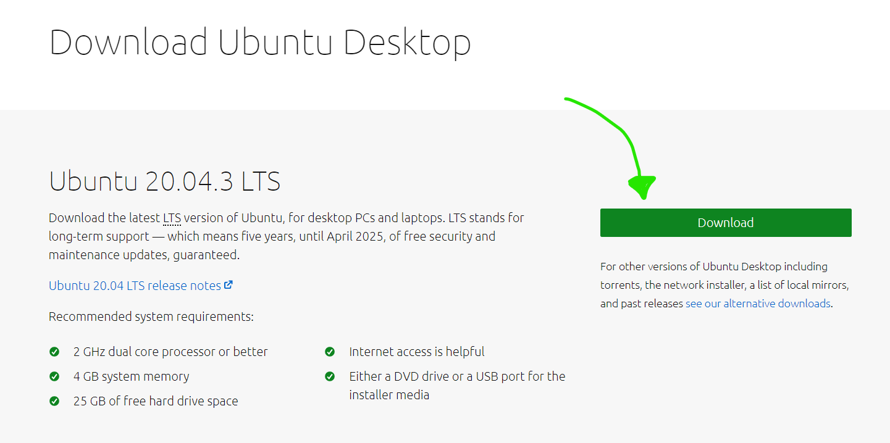

<br/>


<span style="color:#1ECD9E">**Création de la machine virtuelle Ubuntu sur virtual box :**</span>

* lancez VirtualBox puis cliquez sur "Nouvelle" pour créer une nouvelle machine virtuelle.

<br/>

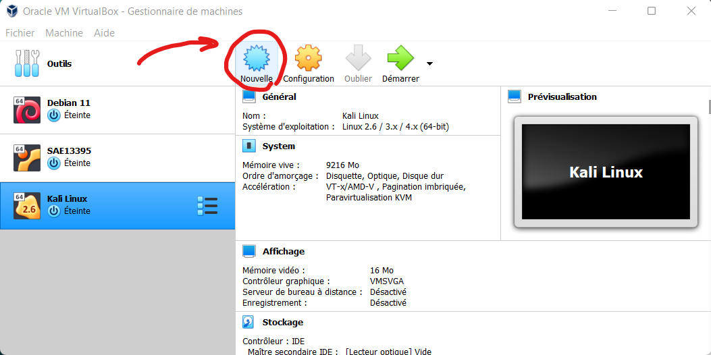

<br/>

* vous pouvez nommez votre machine virtuelle comme vous voulez, moi j'ai choisis Ubuntu comme nom de machine parceque ça correspond au nom de la machine virtuelle que je vais installer, après vous cliquez sur suivant.


<br/>

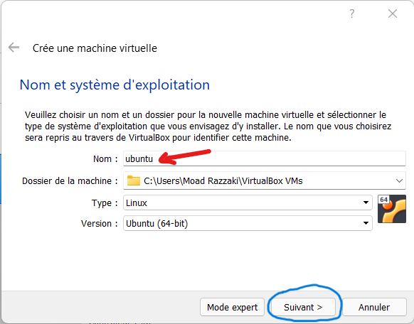

<br/>

* Pour la taille de la mémoire mettez 1/3 de la RAM disponible sur votre système avec 2Go comme minimum, après avoir choisis la taille de la mémoire cliquez sur suivant.


<br/>

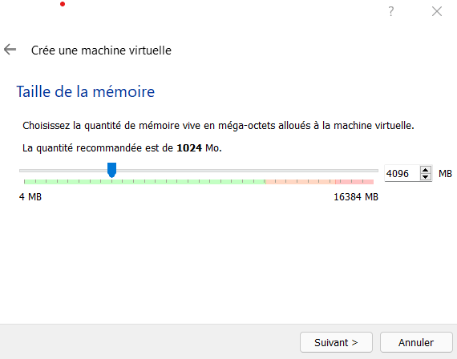

<br/>

* Nous allons créer un nouveau disque dur virtuel donc cliquez sur **Créer** avec l'option **Créer un disque dur virtuel maintenant**, elle est cochée par défaut !!


<br/>

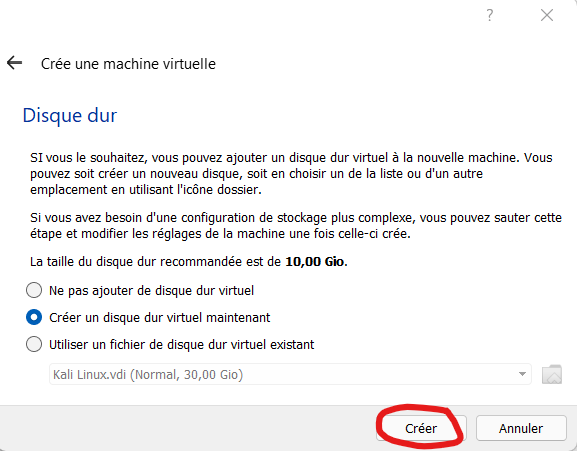

<br/>

* Dans l'étape choisir le type de fichier de disque dur il faut garder l'option par défaut **VDI (VirtualBox Disk Image)** puis cliquer sur **Suivant** : 

<br/>

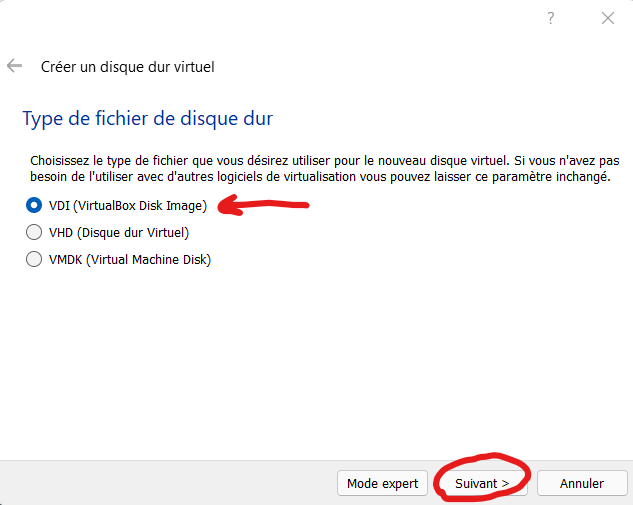

<br/>

* ensuite il faut électionner le choix **Dynamiquement alloué** pour le type de stockage sur disque dur physique afin de ne pas occuper de la place puis cliquez sur le bouton **Suivant** 


<br/>

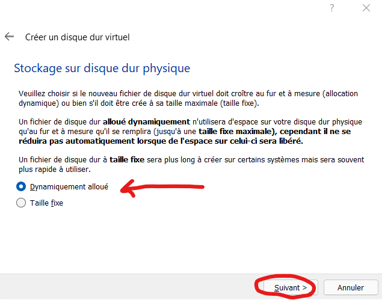

<br/>


* Cliquez sur créer et laissez la taille du disque dûr comme elle est 

<br/>

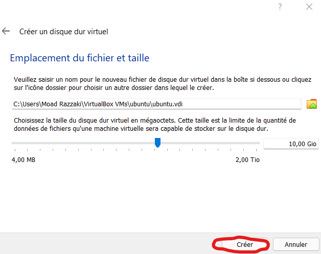

<br/>


<span style="color:#1ECD9E">**Configuration de la machine virtuelle Ubuntu sur virtual box :**</span>

* Cliquez sur configuration pour commencer à configurer votre machine virtuelle.

<br/>

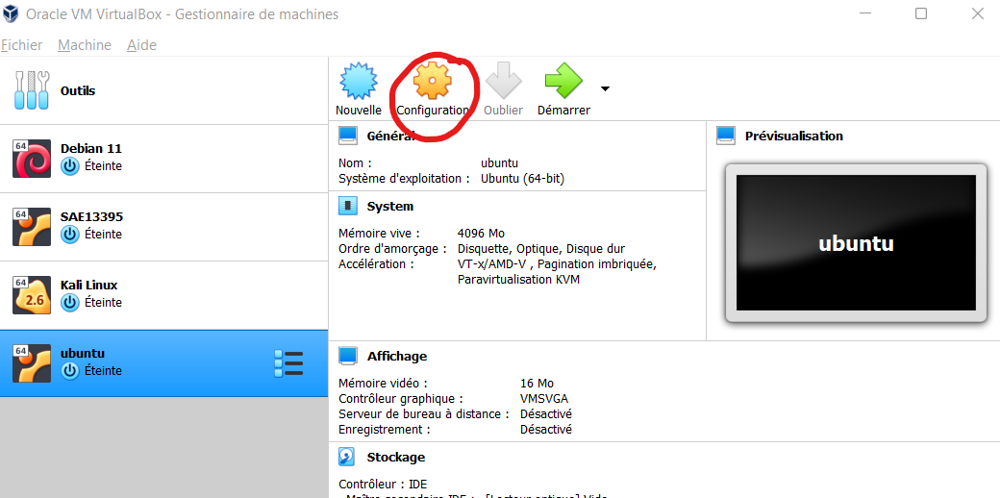

<br/>

* ensuite pour ajouter l'image du disque iso sur votre machine virtuelle, il faut allez dans **stockage** puis séléctionnez le disque bleu puis cliquez sur **choose a disk file .**

<br/>

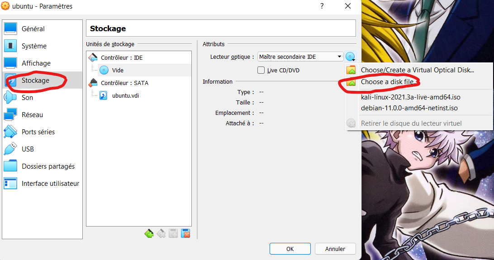

<br/>

* séléctionnez le fichier ISO que vous avez télécharger tout à l'heur et ensuite cliquez sur ouvrir .


<br/>

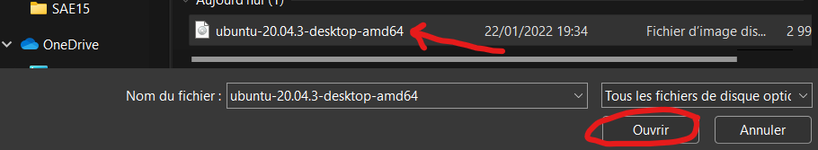

<br/>


* Une chose importante c'est d'activer le presse-papier partagé et le glisser-déposer.

* pour l'activer , Allez dans l'onglet **Général** puis dans l'onglet **Avancé** et activez ces options en tant que "Bidirectionnel" pour que cela marche dans les deux sens **machine hôte vers machine virtuelle et vice-versa**

<br/>

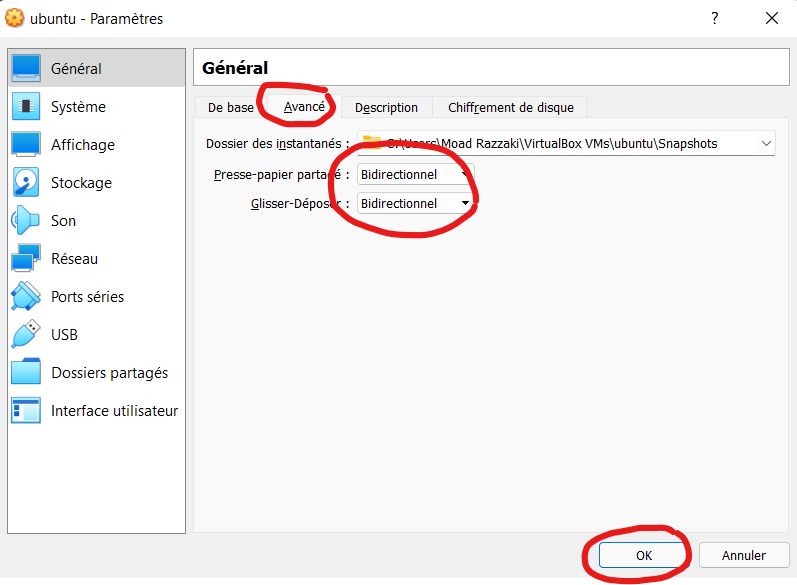

<br/>

* afin d'assurer un fonctionnement rapide de la machine virtuelle mettez un minimum de 2 CPUs (max de 4) dans la zone **Système** => **Processeur** : 

<br/>

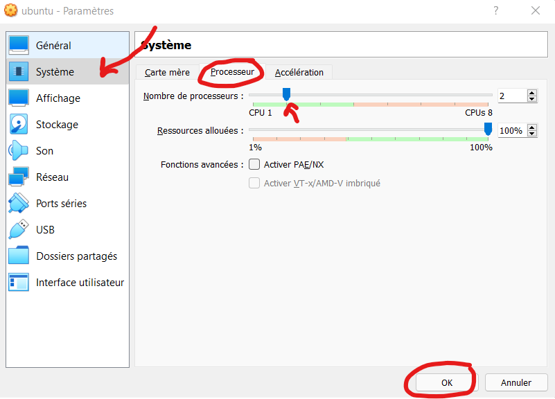

<br/>

* une fois que vous avez finis la configuration de votre machine virtuelle, cliquez sur démarrez :


<br/>

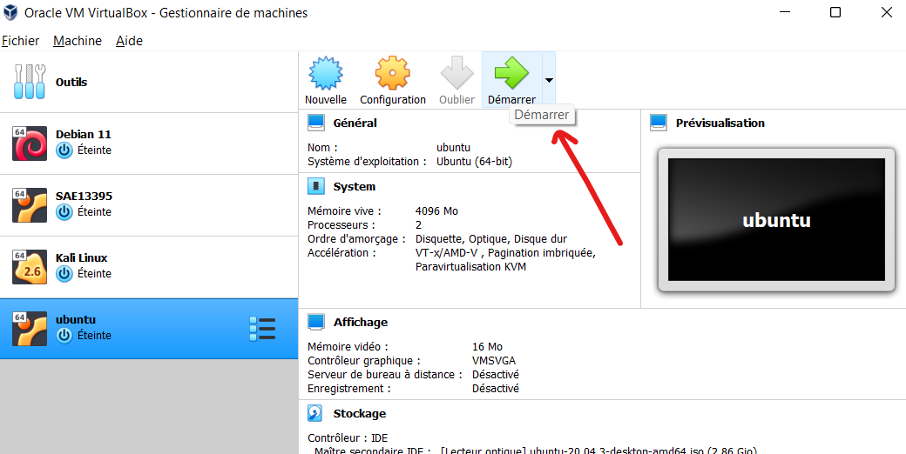

<br/>

* maintenant il vous reste que l'installation de Ubuntu dans la VM de VirtualBox, cliquez sur **installez Ubuntu** :

<br/>

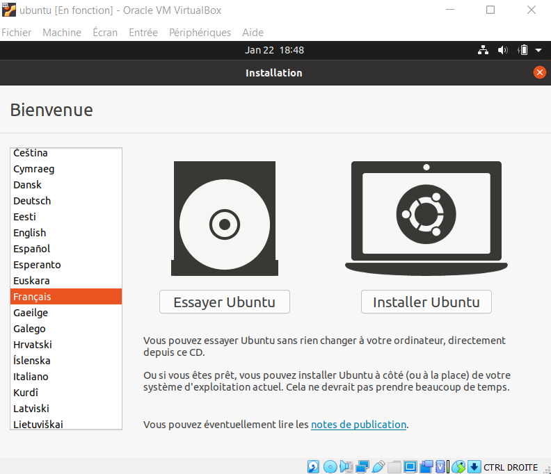

<br/>

* après vous devez cliquez sur continuer si vous avez choisis votre clavier. 

* pour la mise à jour et autres logiciels laissez les configuration cochée par défaut et cliquez sur continuer.

<br/>

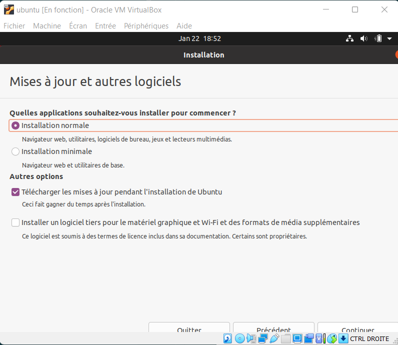

<br/>

* ensuite pour le type d'installation, ne cochez rien et cliquez sur **installez maintenant** .

<br/>

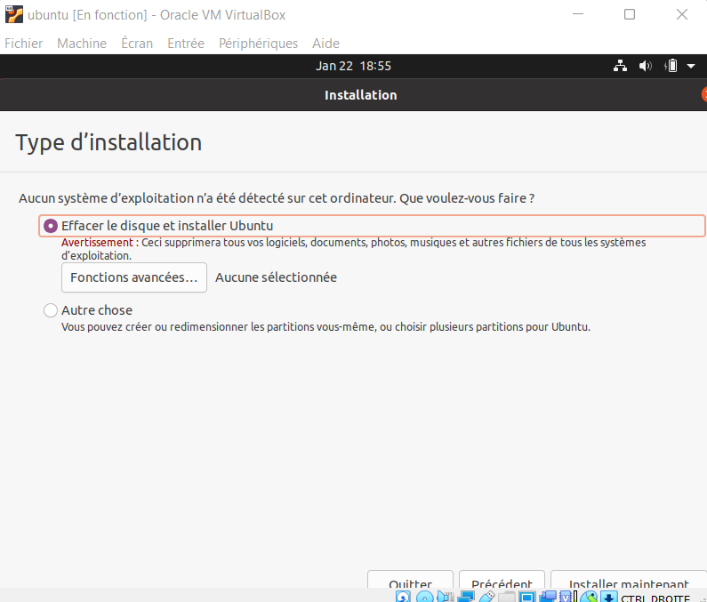

<br/>

* il vous reste que choisir votre nom d'utilisateur et votre mot de passe : 

<br/>

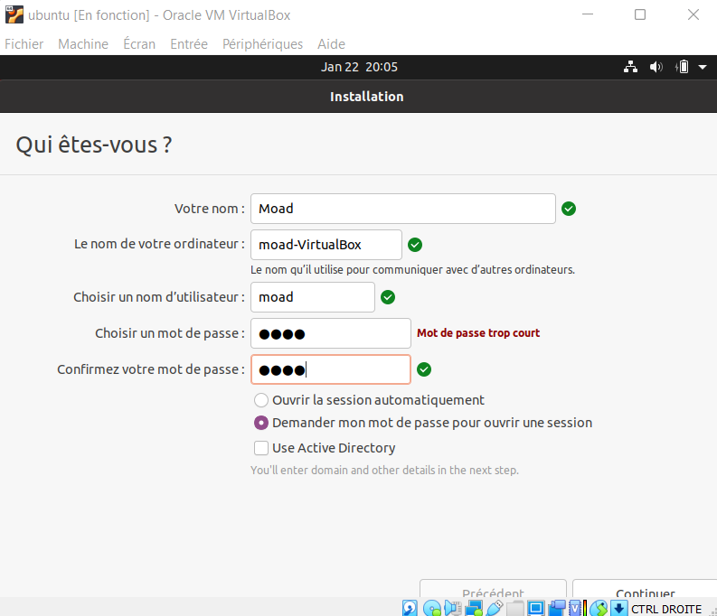

<br/>
<br/>
<br/>
<br/>
<br/>
<br/>
<br/>
<br/>
<br/>
<br/>
<br/>

<center><p>2022 &copy; Moad RAZZAKI -<span style="color:#3DFF05"> Tous droits réservés</span</p></center>
