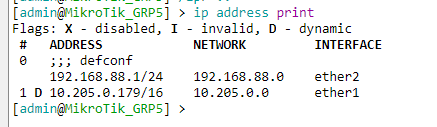
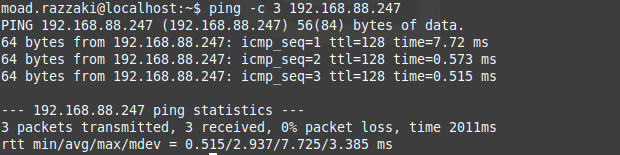
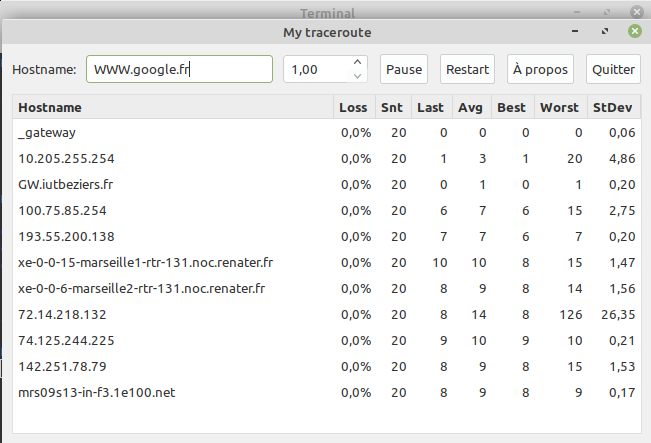
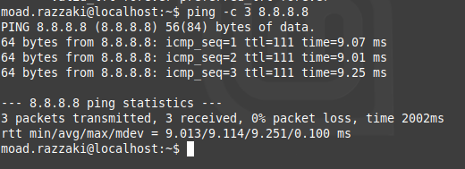

 <h1 style="color:#55DCC0";>Compte rendu SAE 13 Partie minpulation :</h1> 

 

##  *Sommaire :* 
 

[1.   Description de la manipulation](#-description--)

[2.   Schéma du réseau simple qui permet la communication entre les postes](#-shéma-du-réseau-simple-qui-permet-la-communication-entre-deux-postes--)

[3. commandes utilisées pour réaliser cette manipulation](#-commandes-utilisés-pour-réaliser-cette-manipulation--) 

 

-----

 

##  *Description :* 

 

>Il s'agit d'une maquette que l'on doit réaliser afin de montrer au CTO de notre entreprise qu'on est câpable de faire un schéma réseau pour chaque salle et que l'on peut gérer la communication entre deux postes, cette manipulation va nous permettre aussi d'enrichir nos connaissances en réseaux ainsi que de développer nos compétances en ce domaine et améliorer nos capacités de compréhension en faisant des recherches sur les notions réseaux qu'on comprends pas. 

 

 ##   *Shéma du réseau simple qui permet la communication entre deux postes :* 

 

 

**Les équipements informatiques utilisés** : 2 ordinateurs, 2 switchs ( un switch qui permet la connexion entre les deux ordinateurs et l'autre celui de la salle qui nous connecte au routeur de l'iut ), 2 routeurs .
 
  
 

**Les adresses ip utilisés pour les deux pc sont** : 192.168.88.249/24 pour le premier PC et 192.168.88.247/24 pour le deuxième , ensuite pour le routeur j'ai utilisé l'adresse 192.168.88.254/24 dans le premier réseau en vert , et l'adresse 10.205.0.179/16 dans le deuxième réseau en bleu et une passerelle par défaut via le routeur de l'iut. 

 ##   *Commandes utilisés pour réaliser cette manipulation :* 
 
  

  premiérement, il faut brancher le routeur à la goulotte et ensuite le switch au routeur , dans ce  switch on doit brancher les deux PC .
 ### **les paramètres de la carte réseau du deuxième PC deuxième PC :**

  pour afficher les propriétés de ma carte réseau sous windows j'ai utilisé la commande **ipconfig /all** :

   

   

 

> comme on peut le remarquer ce pc est bien connecté à la passerelle **192.168.88.1/24** ( passerelle par défaut )

  

  sur le pc numéro 1 on va utilisé la commande **ip a show eno1** sous Linux pour voir les propriétés de sa carte réseau :

   

  

  et pour afficher les deux adresses du routeur, on tape la commande **ip address print** sur le terminal du routeur MicroTik :
  
   

  
  
   

  on remarque que notre routeur a deux adresses IP, une le permet de jouer le rôle de la passerelle dans le premier réseau, et la deuxième le permet de communiquer avec le deuxième réseaux, il relie alors le réseau vert à internet.

   

ensuite, pour vérifier la connexion entre les deux PC je vais essayer d'envoyer des requêtes ICMP d'un pc vers l'autre en utilisant la commandes PING sur windows :

 

**du premier PC vers le deuxième :**

 

  

  on remarque que tout les paquets envoyés du premier PC ont bien été 
reçu par le deuxième PC.

 

**du deuxième PC vers le premier :**

 

  

 

On va essayer ensuite de déterminer l'itinéraire vers le site www.google.fr en utilisant la commande **tracert** sur windows, cette commande tente d'effectuer le traçage de la route qu'un paquet IP suit pour accéder à un hôte Internet, en lançant des paquets sonde UDP de courte durée de vie , puis en guettant une réponse ICMP TIME_EXCEEDED provenant des passerelles qui se trouvent sur la route. 
Les sondes sont lancées avec une valeur égale à 1 TTL, qui est augmentée d'un TTL à chaque fois jusqu'à ce qu'un message ICMP PORT_UNREACHABLE soit généré. Le message ICMP PORT_UNREACHABLE indique si l'hôte a été localisé ou si la commande a atteint le nombre maximal de bonds autorisés pour la fonction de trace.

 

 

de même sur Linux on peut tracer la route d'un paquet IP en utilisant la commande **mtr www.google.fr**:

 

et enfin, pour s'assuerer qu'on a internet sur les deux PC on peut utiliser la commande **PING** :

**sortie de la commande sur le terminal :**

 

 

2022 &copy; Moad RAZZAKI - Tous droits réservés

